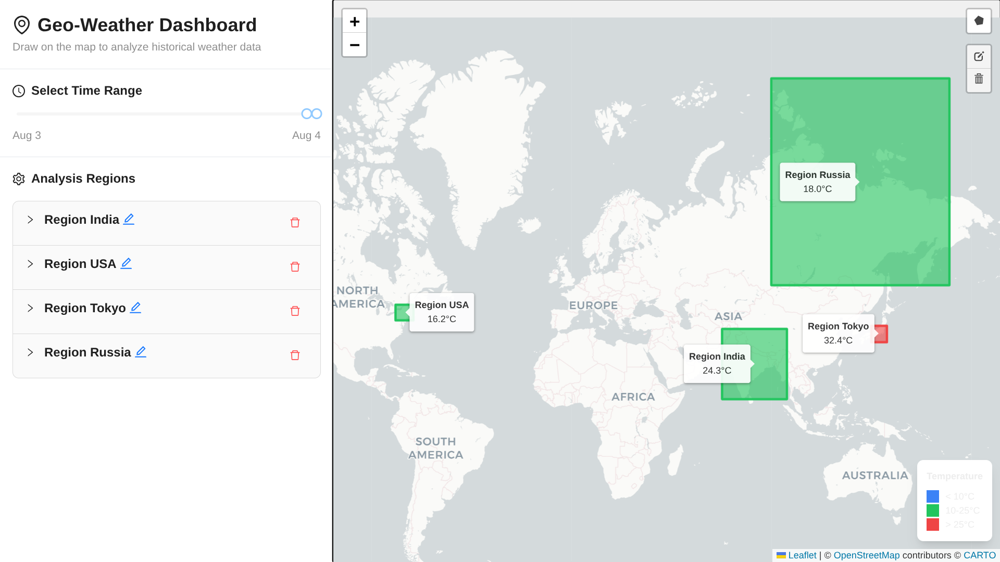

# Geo-Weather Dashboard

An interactive web application built with Next.js and TypeScript to visualize historical weather data on a dynamic map.

Users can define custom geographical regions by drawing polygons, set color-coding rules based on temperature, and explore data across a 30-day historical timeline.

## ✨ Features

  * **Interactive Map:** Pan and draw custom polygonal regions (from 3 to 12 vertices) directly on the map using Leaflet.

  * **Dynamic Data Fetching:** Automatically fetches historical temperature data from the Open-Meteo API for the centroid of each drawn region.

  * **Customizable Rules Engine:** For each region, define custom rules to color-code the polygon based on the fetched temperature (e.g., `< 10°C` is blue, `> 25°C` is red).

  * **Full Polygon Management:** Edit the shape of existing polygons, rename them, and delete them with ease.

  * **State Persistence:** Your drawn regions, rules, and last-used time range are automatically saved to your browser's `localStorage` and restored on your next visit.


  * **Interactive Legend & Tooltips:** A map legend explains the color-to-temperature mapping, and tooltips on each polygon display its name and current data.

## Tech Stack & Libraries Used

This project was built using a modern, type-safe technology stack:

  * **Framework:** Next.js
  * **Language:** TypeScript
  * **UI Components:** Ant Design
  * **Mapping:**
      * [React Leaflet](https://react-leaflet.js.org/): React components for the Leaflet map.
      * [Leaflet](https://leafletjs.com/): The core interactive mapping library.
      * [Leaflet-draw](https://github.com/Leaflet/Leaflet.draw): Plugin for drawing and editing shapes on the map.
  * **State Management:** Zustand
  * **Date & Time:** Day.js

## Setup and Run Instructions

To get a local copy up and running, follow these simple steps.

**Prerequisites:**

  * Node.js 
  * npm or yarn

**Installation & Execution:**

1.  **Clone the repository:**

    ```sh
    git clone https://github.com/SumitKumar-17/geo-dashboard.git
    cd geo-dashboard
    ```

2.  **Install NPM packages:**
    This project has a dependency (`react-leaflet-draw`) that requires a compatibility flag with newer versions of React. Use the following command to install correctly:

    ```sh
    npm install --legacy-peer-deps
    ```

3.  **Run the development server:**

    ```sh
    npm run dev
    ```

4.  Open [http://localhost:3000](https://www.google.com/search?q=http://localhost:3000) with your browser to see the application.

## Design & Development Remarks

  * **State Management Strategy:** Zustand was chosen for its minimal boilerplate. The store was designed with top-level actions (e.g., `setTimeRange`, `addPolygon`) rather than a nested `actions` object to prevent re-render loops and simplify component subscriptions in React 18+.

  * **Client-Side Rendering for Maps:** The map component is loaded using `next/dynamic` with `ssr: false`. This is crucial because Leaflet is a browser-only library that directly manipulates the DOM, which would cause errors during server-side rendering in Next.js.

  * **API Constraints:** The Open-Meteo **Archive API** was used, which only provides historical data. A key development fix was restricting the timeline slider's maximum date to "today" to prevent 400 Bad Request errors that occurred when requesting data for future dates.

  * **Modernizing UI Components:** Ant Design's `<Collapse>` component was refactored from using `children` to using the modern `items` prop, as recommended by the library's deprecation warnings to ensure future compatibility.

## Screenshots

